# 📰 News.io

Portal berita modern berbasis Laravel yang menyediakan fitur membaca berita, pencarian artikel, komentar pengguna, serta dashboard admin untuk mengelola konten berita secara efisien.

## 📖 Tentang Project

News.io merupakan website portal berita yang dibuat menggunakan framework Laravel dan Tailwind CSS.
Project ini dikembangkan sebagai tugas akhir dengan tujuan menyediakan platform berita digital yang modern, responsif, dan mudah digunakan.

Website ini memiliki dua role utama yaitu Admin dan User.
Admin dapat mengelola berita melalui dashboard, sedangkan user dapat membaca berita serta memberikan komentar setelah login.

## 🌟 Fitur Utama

### 1. Home
Halaman utama yang menampilkan postingan unggulan dan akses cepat ke pencarian.

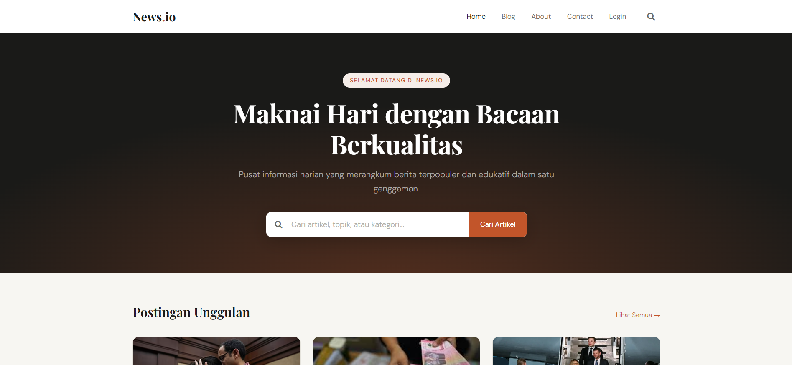
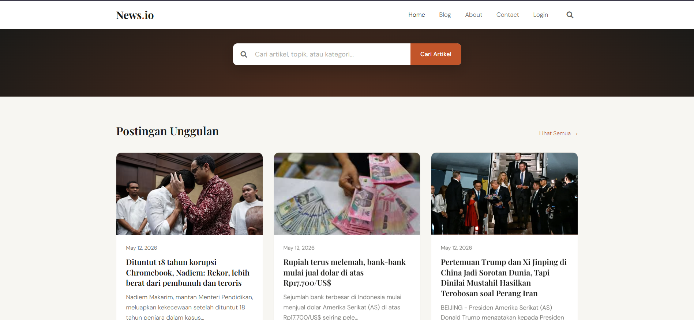
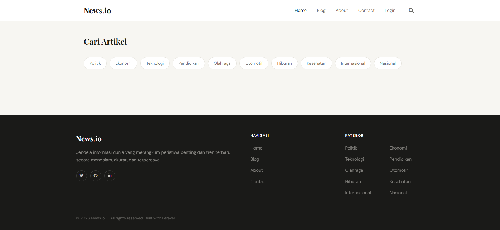

### 2. Blog
Kumpulan artikel berita lengkap yang dapat diakses oleh pengguna.

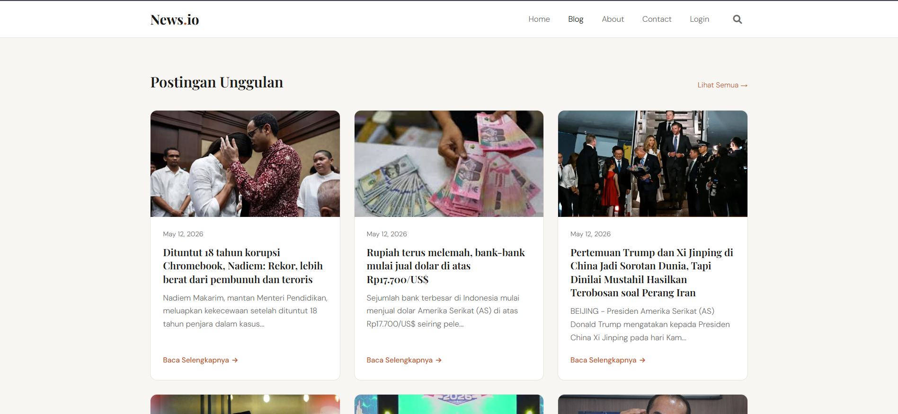

### 3. About
Informasi mengenai profil dan misi di balik News.io.

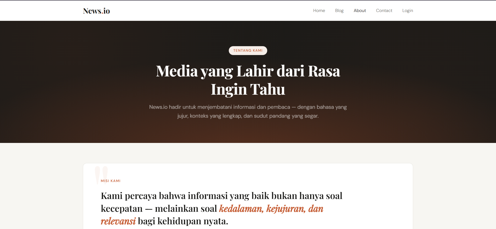
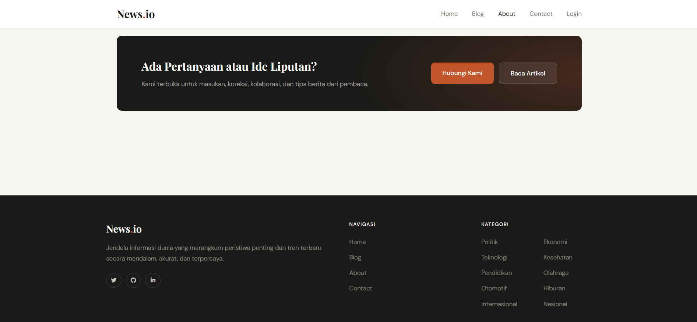

### 4. Contact
Halaman untuk memudahkan pengguna menghubungi admin.

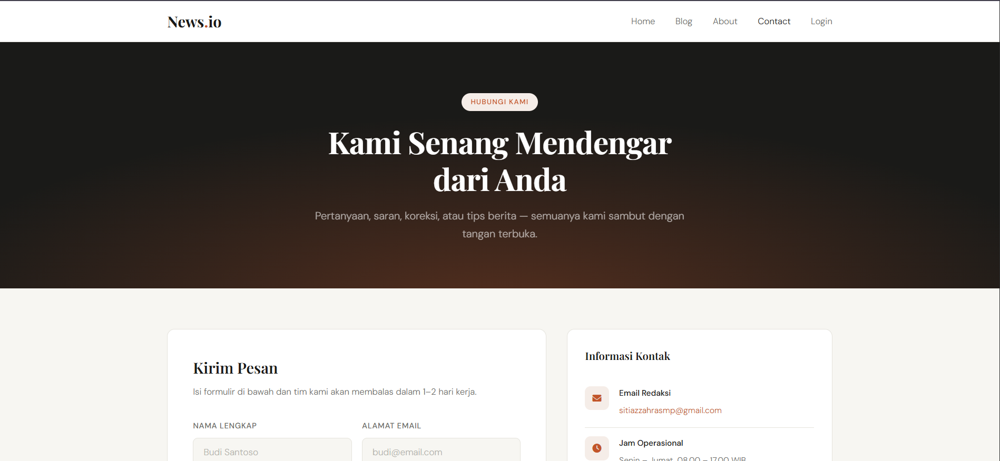
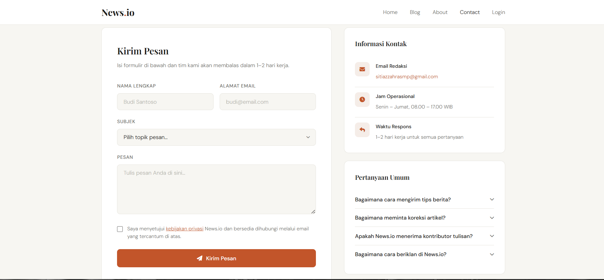

### 5. Login 
Sistem autentikasi untuk membatasi akses ke area administratif.

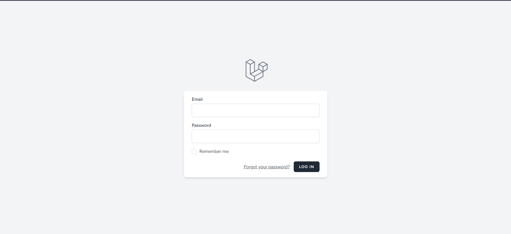

### 6. Dashboard
Panel kontrol khusus bagi admin/penulis untuk manajemen konten berita, kategori, dan pengaturan akun (hanya bisa diakses setelah Login). Disini ada Dashboard untuk Admin dan User :

#### Admin :

Admin memiliki akses penuh terhadap sistem, seperti:

Menambah berita
Mengedit berita
Menghapus berita
Mengelola konten website

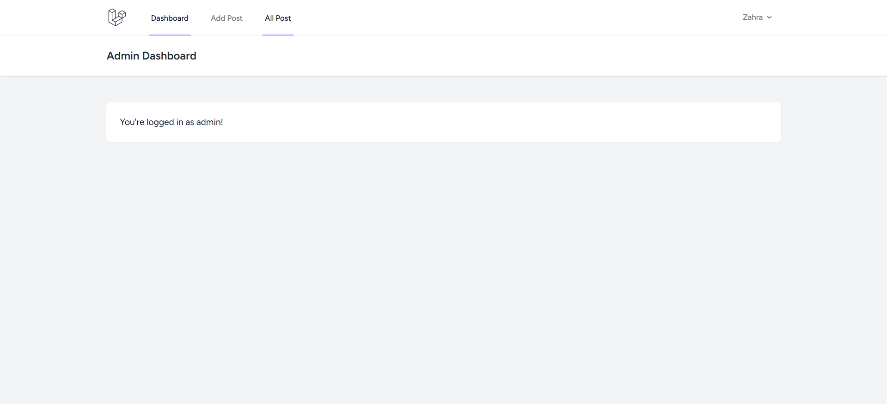
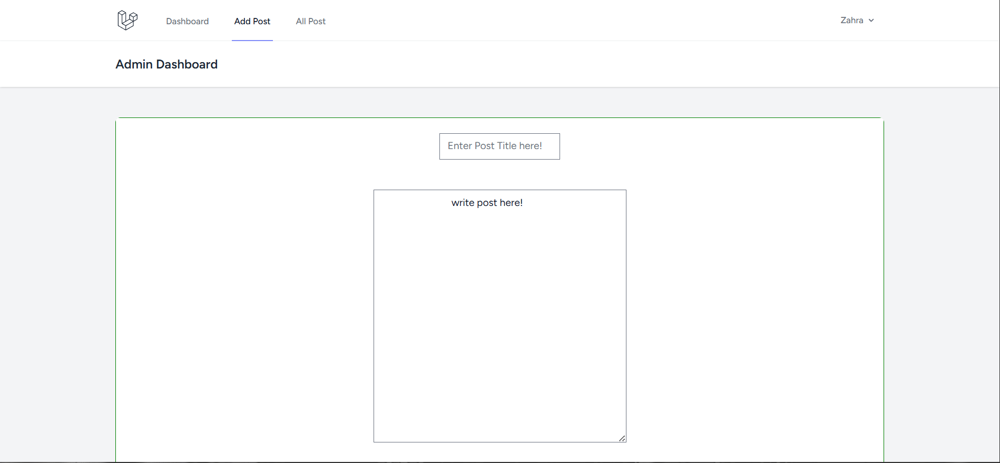
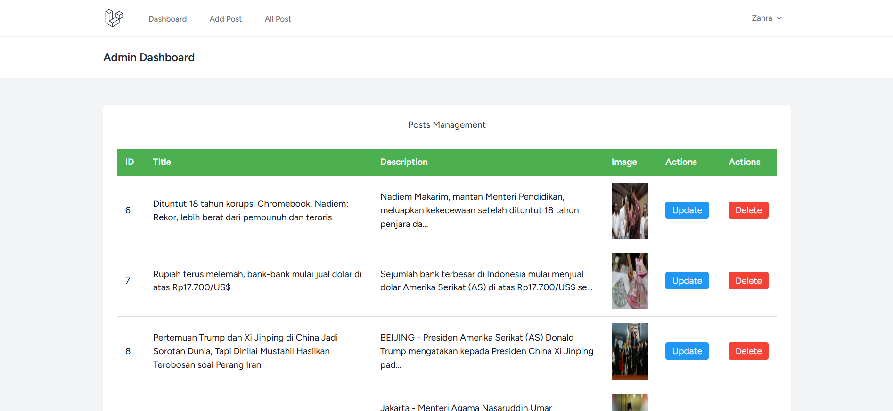

#### User :

User dapat:

Membaca berita
Mencari berita
Memberikan komentar setelah login

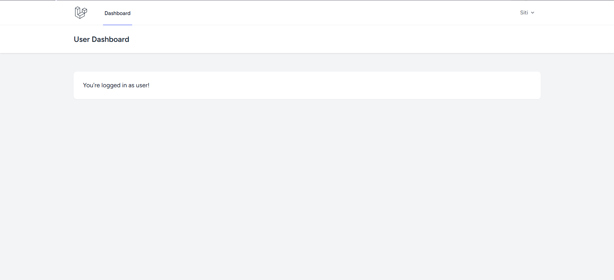

### 7. Pencarian 
Pencarian berita berdasarkan judul & kategori

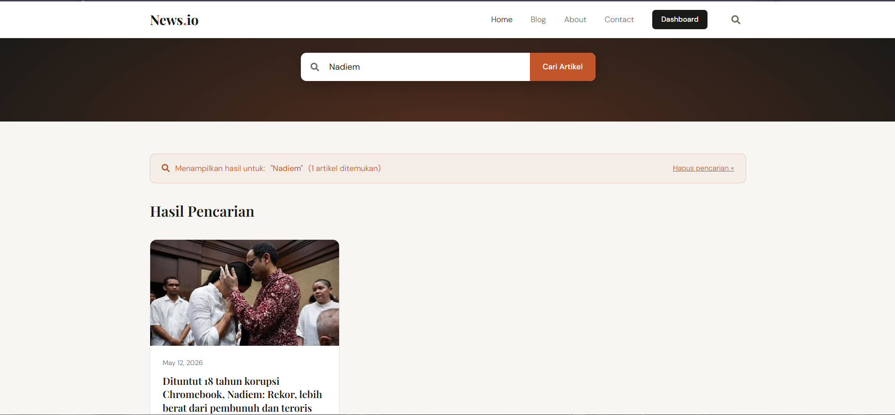

## 🌟 Fitur Pendukung

### 1. Kategori
Halaman utama yang menampilkan postingan unggulan dan akses cepat ke pencarian.

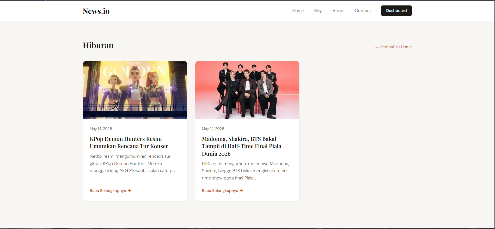

### 2. Berita
Halaman utama yang menampilkan postingan unggulan dan akses cepat ke pencarian.

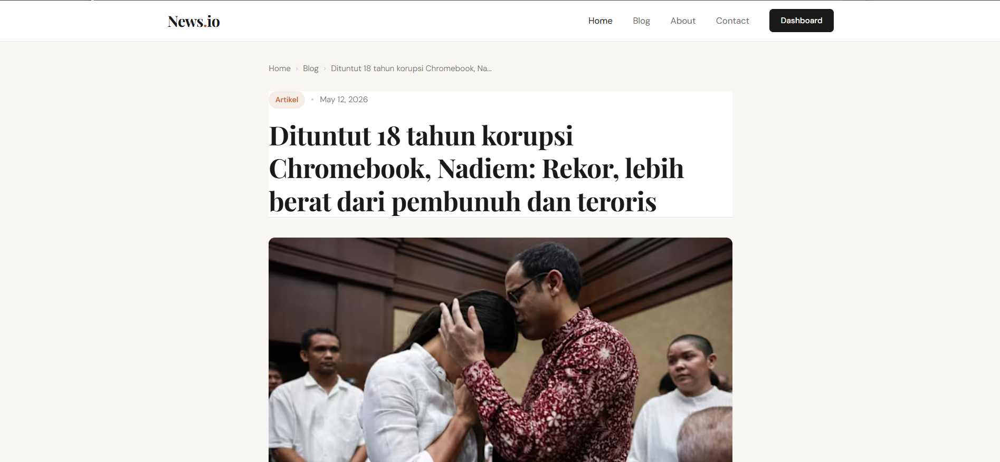

### 3. Komen
Halaman utama yang menampilkan postingan unggulan dan akses cepat ke pencarian.

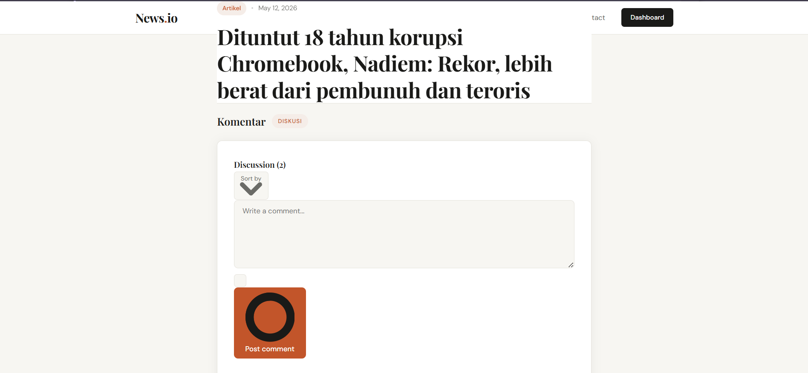

## 🛠️ Tech Stack
* **Framework:** Laravel
* **Database:** MySQL
* **Frontend:** Tailwind
* **Web Server:** Apache (via XAMPP)

### Struktur Database yang Tersimpan

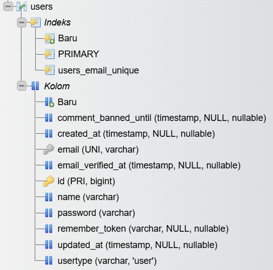
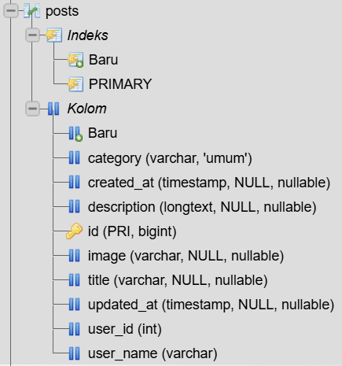
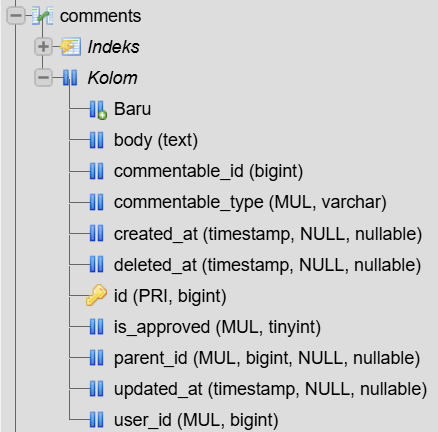
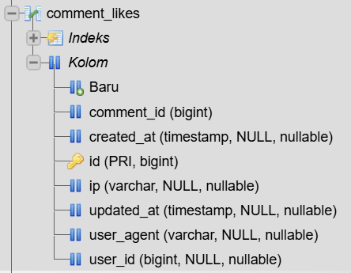
